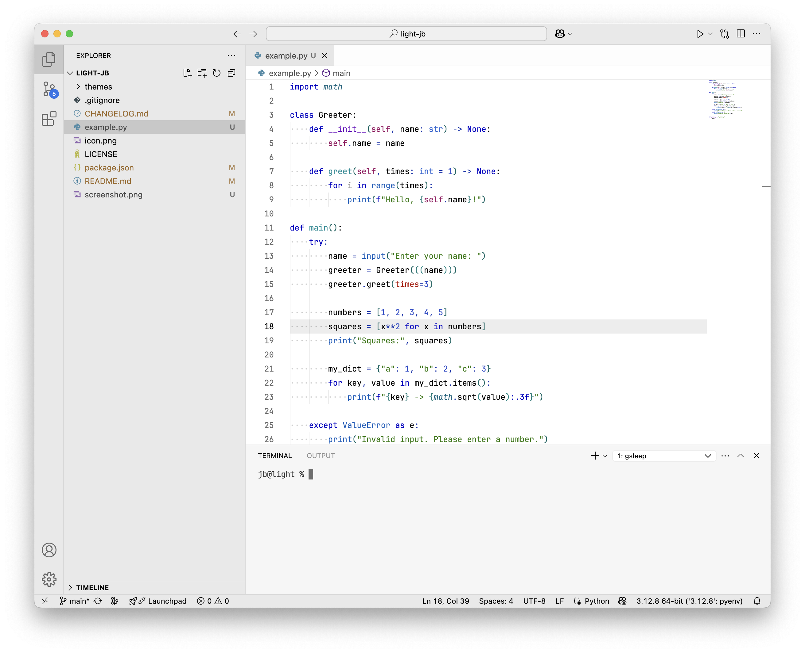

# Light by JB

Light by JB is a carefully crafted light theme designed to feel familiar for those accustomed to Darcula.
It offers:
- Clear, balanced contrasts that maximize readability while maintaining visual comfort.
- Advanced syntax highlighting leveraging [semantic highlighting](https://github.com/microsoft/vscode/wiki/Semantic-Highlighting-Overview) of VS Code, with particular focus on Python.

